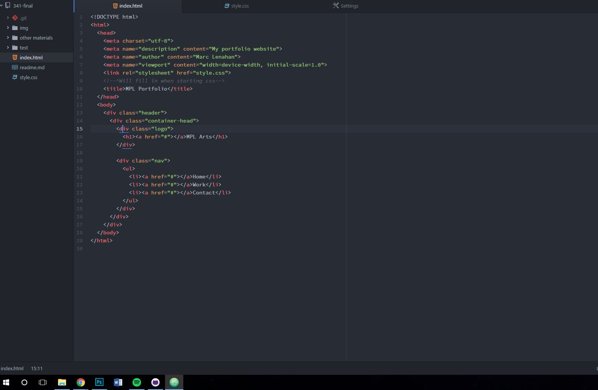
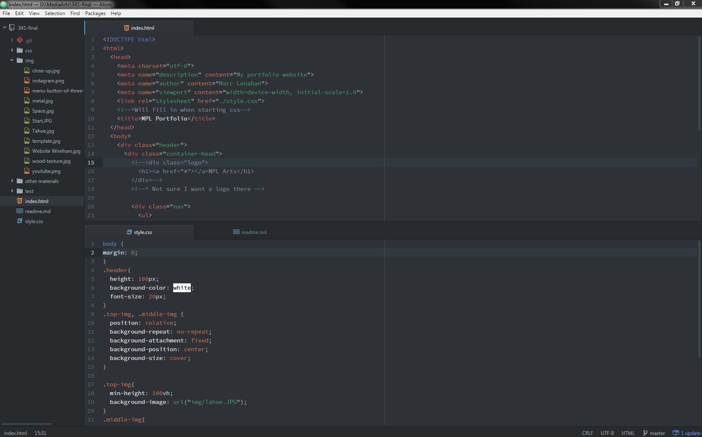
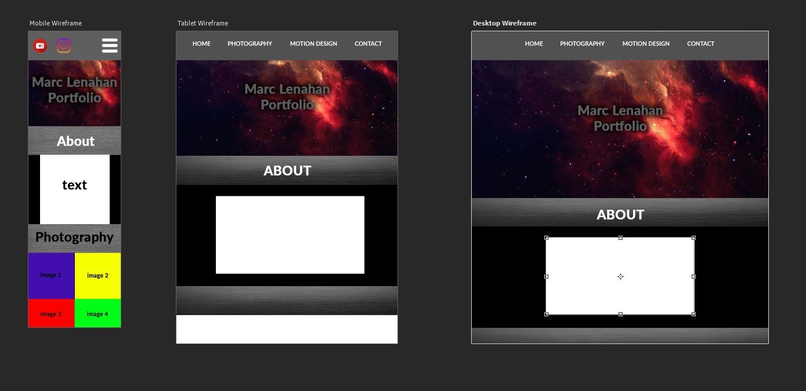

## Initial Ideas:
My idea for my website is going to be a portfolio site for all my work. I think this is a good time as any to start up a portfolio for all the work I will be creating for both classes and future careers. For me this could have been something I should have started a while ago but when I first joined this program I was a little self-conscience of my work. I know that is a common perspective for most people but it just took me a little bit longer to come to a point where I am enjoying the work I am creating despite it still being some sort of beginner level works. A lot of what I will try to add will polished class work but also my own photography and even personal projects to just keep in tune with the various programs we use in the Media Arts program. I will also try to use this website as a reference to possible oppurtunities of work and just get my toes in the water with this industry.

## UPDATE 2
For my second check-in I have took a deeper look into how i want the website to look. For the wire frame at the time I did not have the images I wanted to use for the final site but the idea is there. Basically I have come down to make the site parallax and use anchor links for my links to go from different parts of the page to the next. I will most likely add to this towards the polished site and add gallery links and external links to other social media sites and what not...

## FINAL UPDATE
Wow! this has been one hell of a week. Over this last semester when completing our assignments it seemed like the collection of what we learned would make it easier at the end. Boy did I not know how much was going into this site. Most of the problems I had towards the end were mainly the little details that I wanted to make the site look good but it was worth it to get it working how I want. Over all when everything seemed to work out though I was very happy with everything. I will most likely use this final project as a template for other websites and improve as much as I possibly can with it. Hopefully in ten years it will still be functional.
